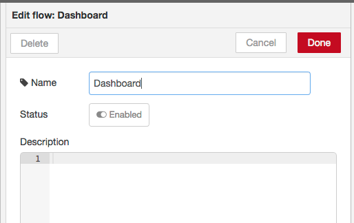

# Dashboard Project


#Table of Contents
1. [Overview](#stas-dashboard-project)
2. [NodeRed](#nodered)
  - [Dashboard Tab](create-dashboard-flow-tab)
  - [Update NodeRed Pallet](#update-the-node-pallet)
  - [Install New Flow](install-dashboard-nodes)
3. [IoT Lab Updates](#ioi-lab-dashboard)
4. [Watson Conversation Updates](#watson-conversation-service)
5. [Hybrid Cloud Updates](#hybrid-cloud-lab-dashboard)
6. [Blockchain Updates](#blockchain-lab-dashboard)

## STSA Dashboard Project

The STSA Dashboard project is designed and built to help show what is occurring in the STSA Labs.
There are two different dashboards. There is a local dashboard that shows all of the details for
each STSA team and there is a global dashboard that aggregates all of the events for each of the
respective teams.

As you do each of the first Four Labs, you can add the hooks to the flows to add information
to the dashboards. Before we can add the hooks for each lab, we need to create the Dashboard flow
within your NodeRed environment.

## NodeRed
Remember you have created several flow with NodeRed running on BlueMix. All of the updates below are for NodeRed running on Bluemix.

## Create Dashboard Flow Tab
Create a new Flow Tab in your main STSA NodeRed instance and call it "Dashboard". This is done by
clicking the "Plus" sign in the upper right side of the screen.


Double click on the Title of the flow and change the name to "Dashboard"



## Update the Node Palette
The Nodes that are used for the dashboard are part of an additional NodeRed package. You can easily
install the package by clicking on the Manage palette menu option.


Once you click on the button, click the **Install** tab and then search for **Dashboard**. Locate
**node-red-dashboard** and click the install button.


Once the install is completed you can click the **close** button.

## Install Dashboard Nodes
Copy the code below and paste it into your new dashboard flow.

```JSON
[
    {
        "id": "7ba788cf.22d5e8",
        "type": "link in",
        "z": "d722f3de.cad83",
        "name": "Iot Main Dash",
        "links": [
            "f8160c87.24af3",
            "59a86bb1.f99aa4"
        ],
        "x": 129,
        "y": 45,
        "wires": [
            [
                "fe9ae489.555888"
            ]
        ]
    },
    {
        "id": "3fd0b2a7.b3258e",
        "type": "http request",
        "z": "d722f3de.cad83",
        "name": "STSA Dashboard",
        "method": "POST",
        "ret": "obj",
        "url": "https://stsa-restservers.mybluemix.net/sendStats",
        "tls": "",
        "x": 908.4444713592529,
        "y": 145.00000762939453,
        "wires": [
            [
                "a67d4b27.5e5c58"
            ]
        ]
    },
    {
        "id": "a67d4b27.5e5c58",
        "type": "debug",
        "z": "d722f3de.cad83",
        "name": "STSA Dashboard",
        "active": false,
        "console": "false",
        "complete": "payload",
        "x": 1157.1110858917236,
        "y": 145.99999713897705,
        "wires": []
    },
    {
        "id": "60e139f3.ccb928",
        "type": "function",
        "z": "d722f3de.cad83",
        "name": "JSON Content Type",
        "func": "msg.header = {\n \"Content-Type\": \"application/json\"\n    \n};\nreturn msg;",
        "outputs": 1,
        "noerr": 0,
        "x": 663.7777843475342,
        "y": 144.88885307312012,
        "wires": [
            [
                "3fd0b2a7.b3258e"
            ]
        ]
    },
    {
        "id": "fe9ae489.555888",
        "type": "function",
        "z": "d722f3de.cad83",
        "name": "format: Iot DashBoard  ",
        "func": "msg.payload.eventtype = \"iot\";\n\n\nreturn msg;",
        "outputs": 1,
        "noerr": 0,
        "x": 351.77775382995605,
        "y": 47.222206115722656,
        "wires": [
            [
                "60e139f3.ccb928"
            ]
        ]
    },
    {
        "id": "f9a77b3c.f60f98",
        "type": "function",
        "z": "d722f3de.cad83",
        "name": "format: Weather Dashboard",
        "func": "msg = {};\nmsg.payload ={ \n    \"eventtype\" :\"weather\"\n};\nreturn msg;",
        "outputs": 1,
        "noerr": 0,
        "x": 345.9999828338623,
        "y": 317.2221908569336,
        "wires": [
            [
                "60e139f3.ccb928"
            ]
        ]
    },
    {
        "id": "2d3eeb9e.8005c4",
        "type": "link in",
        "z": "d722f3de.cad83",
        "name": "Weather Main Dash",
        "links": [
            "f00908a.7ee7cf8",
            "8783cd77.a8a8d"
        ],
        "x": 135.22221183776855,
        "y": 320.3332748413086,
        "wires": [
            [
                "f9a77b3c.f60f98"
            ]
        ]
    },
    {
        "id": "45494b2c.9750f4",
        "type": "link in",
        "z": "d722f3de.cad83",
        "name": "Blockchain Main Dash",
        "links": [
            "4148f3ec.fbc71c",
            "49f14ee9.7518e",
            "992fbb5e.5eeef8",
            "311ae4dc.91edcc",
            "ebfff01f.38f62",
            "70f9b5a5.690dfc",
            "72c526e9.2ec738",
            "ddb4c7c0.9c1a08",
            "6a148c0a.fc5ec4",
            "886597fc.9204f8"
        ],
        "x": 113.66666984558105,
        "y": 726.9999618530273,
        "wires": [
            [
                "69972e4c.6873c"
            ]
        ]
    },
    {
        "id": "96c62d03.4dd3",
        "type": "link in",
        "z": "d722f3de.cad83",
        "name": "WCS Main Dash",
        "links": [
            "83efbb3d.aadc48"
        ],
        "x": 129.0000099605984,
        "y": 124.99999576144745,
        "wires": [
            [
                "3aaa0bf5.a453f4"
            ]
        ]
    },
    {
        "id": "d8436b0c.c8e598",
        "type": "function",
        "z": "d722f3de.cad83",
        "name": "format: Blockchain Remote Dashboard",
        "func": "msg = {}\nmsg.payload = {\n    \"eventtype\":\"blockchain\",\n    \n};\nreturn msg;",
        "outputs": 1,
        "noerr": 0,
        "x": 599.3332958221436,
        "y": 587.8889389038086,
        "wires": [
            [
                "60e139f3.ccb928"
            ]
        ]
    },
    {
        "id": "3aaa0bf5.a453f4",
        "type": "function",
        "z": "d722f3de.cad83",
        "name": "format: WCS Dashboard",
        "func": "msg.payload = {\n    \"eventtype\" : \"conversation\"\n};\nreturn msg;",
        "outputs": 1,
        "noerr": 0,
        "x": 341.77775382995605,
        "y": 118.44441986083984,
        "wires": [
            [
                "60e139f3.ccb928"
            ]
        ]
    },
    {
        "id": "af48cd20.cb6bd",
        "type": "function",
        "z": "d722f3de.cad83",
        "name": "format: KeyValue Dashboard",
        "func": "msg = {}\nmsg.payload = {\n    \"eventtype\":\"keyvalue\",\n    \n};\nreturn msg;",
        "outputs": 1,
        "noerr": 0,
        "x": 329.55555534362793,
        "y": 210.55553436279297,
        "wires": [
            [
                "60e139f3.ccb928"
            ]
        ]
    },
    {
        "id": "9d6662a6.883d",
        "type": "link in",
        "z": "d722f3de.cad83",
        "name": "CICS Main Dash",
        "links": [
            "39b09e43.aace42"
        ],
        "x": 129.0000171661377,
        "y": 207.22222709655762,
        "wires": [
            [
                "af48cd20.cb6bd"
            ]
        ]
    },
    {
        "id": "45fe1ec3.23b0a",
        "type": "ui_text",
        "z": "d722f3de.cad83",
        "group": "2d765072.14101",
        "order": 3,
        "width": 0,
        "height": 0,
        "name": "block count",
        "label": "Blocks in Chain",
        "format": "{{msg.payload}}",
        "layout": "col-center",
        "x": 524.8888988494873,
        "y": 728.1111068725586,
        "wires": []
    },
    {
        "id": "69972e4c.6873c",
        "type": "function",
        "z": "d722f3de.cad83",
        "name": "Number of Blocks",
        "func": "\nif(global.get(\"blocks\") && global.get(\"blocks\")>0){\n    val = global.get(\"blocks\") + 1;\n}else{\n    val = 1;\n}\n\nglobal.set(\"blocks\",val);\nmsg.payload = val;\nreturn msg;",
        "outputs": 1,
        "noerr": 0,
        "x": 304.66666984558105,
        "y": 727.4444808959961,
        "wires": [
            [
                "45fe1ec3.23b0a",
                "d8436b0c.c8e598"
            ]
        ]
    },
    {
        "id": "7e75798d.eae2f8",
        "type": "link in",
        "z": "d722f3de.cad83",
        "name": "status teamname",
        "links": [
            "72c526e9.2ec738"
        ],
        "x": 109.8888988494873,
        "y": 818.1111068725586,
        "wires": [
            [
                "f5502b82.0f0fa8"
            ]
        ]
    },
    {
        "id": "745e033d.d4259c",
        "type": "link in",
        "z": "d722f3de.cad83",
        "name": "status change thermostat",
        "links": [
            "ddb4c7c0.9c1a08"
        ],
        "x": 101.8888988494873,
        "y": 972.1111068725586,
        "wires": [
            [
                "68aa2fad.deff"
            ]
        ]
    },
    {
        "id": "707cdf04.23364",
        "type": "link in",
        "z": "d722f3de.cad83",
        "name": "status recommendation",
        "links": [
            "886597fc.9204f8"
        ],
        "x": 97.8888988494873,
        "y": 1082.1111068725586,
        "wires": [
            [
                "38925f07.ea3ae"
            ]
        ]
    },
    {
        "id": "23b9c42b.f5221c",
        "type": "ui_text",
        "z": "d722f3de.cad83",
        "group": "2d765072.14101",
        "order": 6,
        "width": "6",
        "height": "3",
        "name": "Blockchain status line",
        "label": "Status",
        "format": "{{msg.payload}}",
        "layout": "col-center",
        "x": 548.8888988494873,
        "y": 824.1111068725586,
        "wires": []
    },
    {
        "id": "f5502b82.0f0fa8",
        "type": "function",
        "z": "d722f3de.cad83",
        "name": "Status",
        "func": "if (msg.payload.error && msg.payload.error.code == 2){\n    msg.payload = \"Team Exists\";\nreturn msg;\n    \n}\n\n\nif (msg.payload.teamName){\n    msg.payload = msg.payload.teamName + \" added successfully\";\nreturn msg;\n    \n}\n\n\nif (msg.payload.transactionId){\n    msg.payload = \"Transaction added: <br>\" + msg.payload.transactionId;\n    global.set('lastTransID', msg.payload.transactionId);\n    return msg;\n}\n\n\nmsg.payload = \"\";\nreturn msg;\n",
        "outputs": 1,
        "noerr": 0,
        "x": 259.3333568572998,
        "y": 816.6666488647461,
        "wires": [
            [
                "23b9c42b.f5221c"
            ]
        ]
    },
    {
        "id": "d81d2619.e39fe8",
        "type": "ui_slider",
        "z": "d722f3de.cad83",
        "name": "Thermostat",
        "label": "Thermostat Value",
        "group": "4d641cc2.595f14",
        "order": 5,
        "width": "6",
        "height": "1",
        "passthru": true,
        "topic": "",
        "min": "15",
        "max": "40",
        "step": 1,
        "x": 776.5556468963623,
        "y": 1086.555564880371,
        "wires": [
            [
                "7114b121.2cc44",
                "90d1b1c9.1d43a"
            ]
        ]
    },
    {
        "id": "7114b121.2cc44",
        "type": "function",
        "z": "d722f3de.cad83",
        "name": "Save Thermostat Global",
        "func": "global.set('TempThermostat',msg.payload);\nreturn msg;",
        "outputs": 1,
        "noerr": 0,
        "x": 1126.2221508026123,
        "y": 1089.8886947631836,
        "wires": [
            []
        ]
    },
    {
        "id": "90d1b1c9.1d43a",
        "type": "ui_gauge",
        "z": "d722f3de.cad83",
        "name": "Thermostat Guage",
        "group": "4d641cc2.595f14",
        "order": 6,
        "width": 0,
        "height": 0,
        "gtype": "gage",
        "title": "Thermostat",
        "label": "Celsius",
        "format": "{{value}}",
        "min": "15",
        "max": "40",
        "colors": [
            "#00b500",
            "#e6e600",
            "#ca3838"
        ],
        "seg1": "",
        "seg2": "",
        "x": 1106.1110668182373,
        "y": 1160.777732849121,
        "wires": []
    },
    {
        "id": "5042395c.27c208",
        "type": "ui_text",
        "z": "d722f3de.cad83",
        "group": "4d641cc2.595f14",
        "order": 0,
        "width": "6",
        "height": "1",
        "name": "Thermo Value",
        "label": "Current Thermostat Setting",
        "format": "{{msg.payload}}",
        "layout": "row-spread",
        "x": 768.6667308807373,
        "y": 997.1111068725586,
        "wires": []
    },
    {
        "id": "a3b42ff1.1b42",
        "type": "ui_text",
        "z": "d722f3de.cad83",
        "group": "4d641cc2.595f14",
        "order": 4,
        "width": "6",
        "height": "2",
        "name": "Thormostat status line",
        "label": "Status",
        "format": "{{msg.message}}",
        "layout": "col-center",
        "x": 543.3889064788818,
        "y": 883.944375038147,
        "wires": []
    },
    {
        "id": "68aa2fad.deff",
        "type": "function",
        "z": "d722f3de.cad83",
        "name": "Status",
        "func": "if (msg.payload.error){\n    msg.message = \"Failed to change the Thermostat\";\n    msg.payload = global.get('Thermostat');\n    return msg;\n}\n\nif ((msg.payload.$class) && (msg.payload.$class === \"org.acme.sample.ChangeThermostatTemp\")){\n    if(msg.payload.transactionId){\n        msg.message = \"Changed Thermostat to \" + msg.payload.newThermostatValue;\n        global.set('Thermostat',msg.payload.newThermostatValue );\n        msg.payload = msg.payload.newThermostatValue;\n        return msg;\n    }\n    msg.message = \"Failed to change the Thermostat\";\n    msg.payload = global.get('Thermostat');\n    return msg;\n}\n\n\nmsg.payload = \"\";\nreturn msg;\n",
        "outputs": 1,
        "noerr": 0,
        "x": 260.8333568572998,
        "y": 968.1109848022461,
        "wires": [
            [
                "5042395c.27c208",
                "a3b42ff1.1b42",
                "d81d2619.e39fe8",
                "23b9c42b.f5221c",
                "32371862.83f8d8"
            ]
        ]
    },
    {
        "id": "38925f07.ea3ae",
        "type": "function",
        "z": "d722f3de.cad83",
        "name": "status",
        "func": "\nif ((msg.payload.$class) && (msg.payload.$class === \"org.acme.sample.Team\") && (msg.payload.recommendation)){\n msg.thermo = msg.payload.thermostatTemp;\n msg.payload = msg.payload.recommendation;\n \nreturn msg;\n}\n\nreturn msg;",
        "outputs": 1,
        "noerr": 0,
        "x": 261.1111888885498,
        "y": 1087.2221908569336,
        "wires": [
            [
                "23b9c42b.f5221c",
                "723a39a2.1d7908"
            ]
        ]
    },
    {
        "id": "723a39a2.1d7908",
        "type": "function",
        "z": "d722f3de.cad83",
        "name": "update Thermostat",
        "func": "msg.payload = msg.thermo;\nreturn msg;",
        "outputs": 1,
        "noerr": 0,
        "x": 496.1111888885498,
        "y": 1088.2221908569336,
        "wires": [
            [
                "d81d2619.e39fe8",
                "5042395c.27c208"
            ]
        ]
    },
    {
        "id": "90457168.b383b",
        "type": "ui_gauge",
        "z": "d722f3de.cad83",
        "name": "",
        "group": "f654d25c.80083",
        "order": 0,
        "width": 0,
        "height": 0,
        "gtype": "gage",
        "title": "Temperature",
        "label": "Celsius",
        "format": "{{value}}",
        "min": "25",
        "max": "45",
        "colors": [
            "#00b500",
            "#e6e600",
            "#ca3838"
        ],
        "seg1": "",
        "seg2": "",
        "x": 539.6389102935791,
        "y": 397.61111640930176,
        "wires": []
    },
    {
        "id": "e0701cae.4e12",
        "type": "ui_chart",
        "z": "d722f3de.cad83",
        "name": "",
        "group": "f654d25c.80083",
        "order": 0,
        "width": 0,
        "height": 0,
        "label": "chart",
        "chartType": "line",
        "legend": "false",
        "xformat": "HH:mm:ss",
        "interpolate": "linear",
        "nodata": "Waiting on temperature data",
        "ymin": "",
        "ymax": "",
        "removeOlder": 1,
        "removeOlderPoints": "",
        "removeOlderUnit": "3600",
        "cutout": 0,
        "colors": [
            "#1f77b4",
            "#aec7e8",
            "#ff7f0e",
            "#2ca02c",
            "#98df8a",
            "#d62728",
            "#ff9896",
            "#9467bd",
            "#c5b0d5"
        ],
        "x": 529.8889083862305,
        "y": 494.36111640930176,
        "wires": [
            [],
            []
        ]
    },
    {
        "id": "c1c0e502.114d58",
        "type": "link in",
        "z": "d722f3de.cad83",
        "name": "Temperature Gauges",
        "links": [
            "2dcfad9.1e84952",
            "f8160c87.24af3",
            "59a86bb1.f99aa4"
        ],
        "x": 137.88889884948725,
        "y": 460.1111068725585,
        "wires": [
            [
                "9f4dfa10.944408"
            ]
        ]
    },
    {
        "id": "9f4dfa10.944408",
        "type": "function",
        "z": "d722f3de.cad83",
        "name": "format: temperature",
        "func": "msg.payload = msg.payload.d.temperature;\nreturn msg;",
        "outputs": 1,
        "noerr": 0,
        "x": 307.26390647888184,
        "y": 452.3611145019531,
        "wires": [
            [
                "90457168.b383b",
                "e0701cae.4e12"
            ]
        ]
    },
    {
        "id": "32371862.83f8d8",
        "type": "debug",
        "z": "d722f3de.cad83",
        "name": "block debug",
        "active": false,
        "console": "false",
        "complete": "payload",
        "x": 1024.7638988494873,
        "y": 792.3611068725586,
        "wires": []
    },
    {
        "id": "8a0e21cd.0438b",
        "type": "ui_template",
        "z": "d722f3de.cad83",
        "group": "f654d25c.80083",
        "name": "SenseHat Background",
        "order": 0,
        "width": "6",
        "height": "1",
        "format": "<div md-colors=\"{background: msg.payload}\">\n\n<p>background color is now  {{msg.payload}}</p>\n</div>",
        "storeOutMessages": true,
        "fwdInMessages": true,
        "x": 306.3888988494873,
        "y": 1198.1111068725586,
        "wires": [
            []
        ]
    },
    {
        "id": "be0d0111.f30ab",
        "type": "link in",
        "z": "d722f3de.cad83",
        "name": "SenseHat Display",
        "links": [
            "b528fe2f.6a042"
        ],
        "x": 98.3888988494873,
        "y": 1204.1111068725586,
        "wires": [
            [
                "8a0e21cd.0438b"
            ]
        ]
    },
    {
        "id": "d0601ed1.c0589",
        "type": "link in",
        "z": "d722f3de.cad83",
        "name": "Weather Dashboard",
        "links": [
            "8783cd77.a8a8d"
        ],
        "x": 104.55555629730225,
        "y": 1312.777750968933,
        "wires": [
            [
                "42f7fe5d.6844b"
            ]
        ]
    },
    {
        "id": "42f7fe5d.6844b",
        "type": "function",
        "z": "d722f3de.cad83",
        "name": "Cache Weather",
        "func": "global.set('weather-observation',msg.observation);\nmsg.payload = msg.observation;\nreturn msg;",
        "outputs": 1,
        "noerr": 0,
        "x": 319.55555534362793,
        "y": 1313.888816833496,
        "wires": [
            [
                "edcaf993.87afe8",
                "62c8a657.0eb318"
            ]
        ]
    },
    {
        "id": "be350c60.7e20d",
        "type": "ui_gauge",
        "z": "d722f3de.cad83",
        "name": "Feels like",
        "group": "aecfa20f.9b8a9",
        "order": 8,
        "width": 0,
        "height": 0,
        "gtype": "gage",
        "title": "Feels Like",
        "label": "Celsius",
        "format": "{{value}}",
        "min": "15",
        "max": "40",
        "colors": [
            "#00B500",
            "#E6E600",
            "#CA3838"
        ],
        "seg1": "",
        "seg2": "",
        "x": 713.3333492279053,
        "y": 1283.1110286712646,
        "wires": []
    },
    {
        "id": "840567ed.131b78",
        "type": "ui_gauge",
        "z": "d722f3de.cad83",
        "name": "Outside Temerature",
        "group": "aecfa20f.9b8a9",
        "order": 9,
        "width": 0,
        "height": 0,
        "gtype": "gage",
        "title": "Outside",
        "label": "Celsius",
        "format": "{{value|number:1}}",
        "min": "15",
        "max": "40",
        "colors": [
            "#00B500",
            "#E6E600",
            "#CA3838"
        ],
        "seg1": "",
        "seg2": "",
        "x": 735.3333492279053,
        "y": 1337.1110286712646,
        "wires": []
    },
    {
        "id": "edcaf993.87afe8",
        "type": "function",
        "z": "d722f3de.cad83",
        "name": "Get Feels Like",
        "func": "msg.payload = msg.payload.feels_like\nreturn msg;",
        "outputs": 1,
        "noerr": 0,
        "x": 514.3333492279053,
        "y": 1285.1110286712646,
        "wires": [
            [
                "be350c60.7e20d"
            ]
        ]
    },
    {
        "id": "62c8a657.0eb318",
        "type": "function",
        "z": "d722f3de.cad83",
        "name": "Get Outside",
        "func": "msg.payload = msg.payload.temp\nreturn msg;",
        "outputs": 1,
        "noerr": 0,
        "x": 504.3333492279053,
        "y": 1338.1110286712646,
        "wires": [
            [
                "840567ed.131b78"
            ]
        ]
    },
    {
        "id": "2d765072.14101",
        "type": "ui_group",
        "z": "",
        "name": "Blockchain",
        "tab": "e31279db.b69008",
        "order": 2,
        "disp": true,
        "width": "6"
    },
    {
        "id": "4d641cc2.595f14",
        "type": "ui_group",
        "z": "",
        "name": "Thermostat",
        "tab": "e31279db.b69008",
        "order": 4,
        "disp": true,
        "width": "6"
    },
    {
        "id": "f654d25c.80083",
        "type": "ui_group",
        "z": "",
        "name": "SenseHat",
        "tab": "e31279db.b69008",
        "order": 1,
        "disp": true,
        "width": "6"
    },
    {
        "id": "aecfa20f.9b8a9",
        "type": "ui_group",
        "z": "",
        "name": "Outside Temperatures",
        "tab": "e31279db.b69008",
        "order": 3,
        "disp": true,
        "width": "6"
    },
    {
        "id": "e31279db.b69008",
        "type": "ui_tab",
        "z": "",
        "name": "Home",
        "icon": "dashboard",
        "order": 2
    }
]

```
To paste the copied code click in the upper right and select **import->clipboard**


Paste the code into the Editor window, make sure "current flow" is selected. Then click the **Import** button.


Once you have pasted into your new flow the screen should look similar to the following:


That is it. You have added the Dashboard to your application.
The dashboard can be viewed by opening a browser window to the same URL of your NodeRed
application but removing everything to the right of "/red..." and replace with "/ui".
Similar to the following

`https://jdcalus-stsa.mybluemix.net/red/#`

to

`https://jdcalus-stsa.mybluemix.net/ui/`

Remember we have created the Dashboard, but nothing is sending it data.  Now after each lab completed,
follow the steps below to add the Dashboard functionality to each of the respective Labs.

## IoT Lab Dashboard
Click on the flow tab that has your IoT flows. Next add a "Link" node to the flow.


Drag the link node to the pallet and place it near the **environment** IoT node. Then connect the "environment" node to the "Link" node


Now double click on the **Link** node. Update the information like in the image below


Click **Done** and then click **Deploy**

Your IoT information should be updating the Dashboard


## Watson Conversation Service
Watson Conversation only has 2 links to the dashboard. This is to show how many times there is a request to a Watson Conversation service. To do this, we will create a link node right after the call to WCS.

Drag the **Link** node from the palette to just above **STSA-CONV** node.


Now double click on the link node to create a link to the dashboard. Update you details for your flow.


Next we want to change the color of the local dashboard when the sense hat color is changed. Drag another "output link" node to the flow. This time put it by the **ChangeIoTColor** function node.


Double click on the new link node and update the appropriate checkbox details.


Click **Done** and then click **Deploy**. Your updates should be sent to the local and global dashboards.

You are done for this dashboard updates. Nice Job!


## Hybrid Cloud Lab Dashboard
In the hybrid cloud we want to show how many times we are making API calls to other cloud providers.
So similarly to the prior two labs we want to create a link from our flow code to the dashboard.

1. Connect the two weather API calls to the same **Link** node like in the diagram below

And then select the "Weather Dashboard" checkbox


2. Connect each of the two http requests (CICS calls) to a new link.

And the CICS link details are as follows:


Click **Done** and then click **Deploy**. Your updates should be sent to the local and global dashboards.

We are all set. Way to go!


## Blockchain Lab Dashboard
Refer to the Blockchain STSA Lab for these instructions. They are part of the lab.
